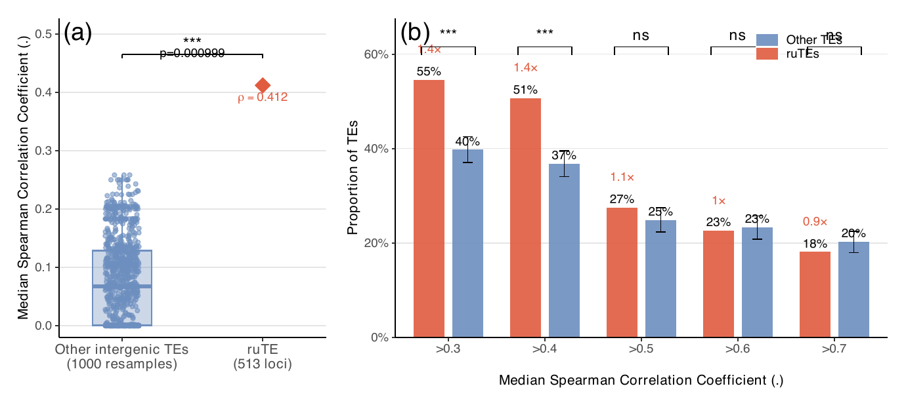

# TE-gene co-expression analysis

Reproducible R workflow for testing whether infection-responsive transposable
elements (ruTEs) are more strongly co-expressed with nearby genes than other
intergenic TE loci. The analysis uses seven infection time-course RNA-seq
datasets and generates the Figure 4A-B resampling analysis.



The publication-ready PDF and summary statistics are available in
[`results/published/`](results/published/).

## Workflow

| Step | Script | Purpose |
| --- | --- | --- |
| 1 | `scripts/01_normalize_expression.R` | Rename samples and convert gene/TE counts to log2(TPM + 1). |
| 2 | `scripts/02_find_nearest_genes.R` | Find the closest gene TSS within 50 kb of each intergenic TE. |
| 3 | `scripts/03_create_te_gene_map.R` | Validate the TE-gene map and assign `ruTE`/`background` labels. |
| 4 | `scripts/04_calculate_rute_correlations.R` | Calculate Spearman correlations across infection time points. |
| 5 | `scripts/05_make_figure4.R` | Run 1,000 background resamples, calculate empirical P values, and plot Figure 4A-B. |

All paths and analysis parameters are defined in
[`config/analysis_config.R`](config/analysis_config.R). Scripts use paths
relative to the repository, so no local user path is embedded in the code.

## Requirements

- R 4.3 or newer
- `bedtools` (required by step 2)
- R packages: `data.table`, `doParallel`, `dplyr`, `foreach`, `ggplot2`,
  `patchwork`, and `stringr`

Install the R packages with:

```bash
Rscript requirements.R
```

Install `bedtools` with your operating system's package manager, for example:

```bash
# macOS
brew install bedtools

# Ubuntu/Debian
sudo apt-get install bedtools
```

## Input data

Small metadata files are included under `data/reference/`. Large BED and
expression files are deliberately excluded from Git because some exceed
GitHub's file-size limit.

Before running the workflow, add the following files:

```text
data/
├── reference/
│   ├── Genes_0based.bed
│   ├── TEs_all_other_intergenic_0based.bed
│   ├── ruTE_other_intergenic_n595.txt
│   └── sample_info_7_datasets_with_timecourse.csv
└── raw_expression/
    ├── <dataset>_readscounts_matrix_Gene.txt
    └── <dataset>_readscounts_matrix_TE_Loci.txt
```

See [`data/README.md`](data/README.md) for column definitions, all expected
dataset names, file sizes, and checksums.

## Run the analysis

Run commands from the repository root:

```bash
Rscript scripts/01_normalize_expression.R
Rscript scripts/02_find_nearest_genes.R
Rscript scripts/03_create_te_gene_map.R
Rscript scripts/04_calculate_rute_correlations.R
Rscript scripts/05_make_figure4.R
```

The complete workflow processes several gigabytes and can require substantial
memory and time. For a quick pipeline check, reduce the number of permutations
and CPU workers:

```bash
TE_COEXPR_N_PERMUTATIONS=10 TE_COEXPR_N_CORES=2 \
  Rscript scripts/05_make_figure4.R
```

Common environment-variable overrides are:

| Variable | Default | Meaning |
| --- | --- | --- |
| `TE_COEXPR_GENE_BED` | `data/reference/Genes_0based.bed` | Gene BED path |
| `TE_COEXPR_TE_BED` | `data/reference/TEs_all_other_intergenic_0based.bed` | Intergenic TE BED path |
| `TE_COEXPR_RAW_EXPRESSION` | `data/raw_expression` | Raw count-matrix directory |
| `TE_COEXPR_NORMALIZED_EXPRESSION` | `data/normalized_expression` | Normalized-matrix directory |
| `TE_COEXPR_N_CORES` | up to 8 physical cores | Parallel workers |
| `TE_COEXPR_N_PERMUTATIONS` | `1000` | Background resamples |
| `TE_COEXPR_RANDOM_SEED` | `123` | Reproducibility seed |

## Outputs

- `data/processed/`: standardized sample metadata
- `data/normalized_expression/`: normalized gene and TE matrices
- `results/nearest_gene/`: nearest-gene table and compact TE-gene map
- `results/correlation/`: ruTE correlation results and summary
- `results/figure4/`: resampling distributions, summary statistics, and PDFs
- `results/published/`: selected small results included in this repository

Generated and large files are excluded by `.gitignore`; selected publication
outputs are versioned separately in `results/published/`.

## Reproducibility notes

- Biological replicates are averaged at each time point before correlation.
- A TE-gene correlation requires at least three aggregated time points.
- Spearman correlation is used for each TE-gene pair in each dataset.
- Per-TE statistics use the median correlation across valid datasets.
- Empirical P values use a one-sided test with the correction
  `(1 + exceedances) / (1 + valid permutations)`.
- The default background sample contains 595 other intergenic TE loci and is
  repeated 1,000 times with random seed 123.

## Included result

The included run yielded an observed ruTE median correlation of 0.412
(`P = 0.000999`). The proportions above 0.3 and 0.4 were also significant at
the same empirical P value. Exact values are in
[`figure4_AB_1000resamples_summary_stats.tsv`](results/published/figure4_AB_1000resamples_summary_stats.tsv).
